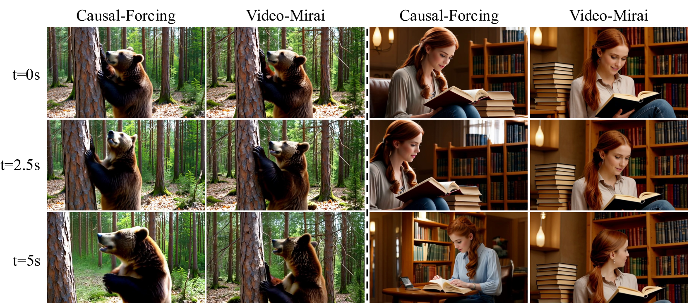

# Video-Mirai: Autoregressive Video Diffusion Models Need Foresight

<div align="center">

[]()
[](https://y0urOy.github.io/Video-Mirai/)
[](LICENSE)

</div>

<p align="center">
  
</p>

This is the official PyTorch implementation of the paper
**"Video-Mirai: Autoregressive Video Diffusion Models Need Foresight"**.

> Causal video generators are under-constrained at the segment level: many hidden
> states can decode the same plausible current segment, but only some retain the
> identity, layout, and motion cues that *future* segments will need. Video-Mirai
> closes this representation-level planning gap by letting a frozen bidirectional
> encoder supervise the causal hidden state with **future-aware feature targets** —
> at training time only. At inference, the foresight encoder and predictor are
> discarded; the deployed generator keeps its causal architecture, FLOPs, and
> KV-cache behavior **unchanged**.

---

## 🛠️ Installation

```bash
conda create -n video-mirai python=3.10
conda activate video-mirai
pip install -r requirements.txt

# flash-attn needs a matching CUDA toolchain and is best installed separately
pip install flash-attn --no-build-isolation
```

CUDA 12.x + PyTorch ≥ 2.4 + FSDP-compatible PyTorch is recommended.

---

## ⬇️ Download

The training entry point expects three external resources. All commands below
use the `hf` CLI (install with `pip install huggingface_hub[cli]`).

### 1. Wan2.1 model weights (T5 encoder + VAE + DiT)

`utils/wan_wrapper.py` loads the **T5 encoder and VAE from Wan2.1-T2V-1.3B**
and the **DiT backbone from Wan2.1-T2V-14B** (the bidirectional foresight
teacher reuses the same 14B model). You need both:

```bash
hf download Wan-AI/Wan2.1-T2V-1.3B --local-dir wan_models/Wan2.1-T2V-1.3B
hf download Wan-AI/Wan2.1-T2V-14B  --local-dir wan_models/Wan2.1-T2V-14B
```

### 2. Causal-Forcing warm-start checkpoint

The foresight stage distills from a pre-trained causal generator. The YAML
points at `checkpoints/chunkwise/causal_ode.pt`, which is released by the
thu-ml/Causal-Forcing repo:

```bash
hf download zhuhz22/Causal-Forcing chunkwise/causal_ode.pt --local-dir checkpoints
```

Any compatible Causal-Forcing / Self-Forcing checkpoint can be used as the
warm start — update `generator_ckpt` in the YAML accordingly.

### 3. Training prompts (~140 MB)

Inference prompts (`MovieGenVideoBench.txt`, `MovieGenVideoBench_extended.txt`,
`demos.txt`) are already bundled under `prompts/`. The large training corpus
referenced by `data_path` in the YAML is **not** bundled:

```bash
hf download gdhe17/Self-Forcing vidprom_filtered_extended.txt --local-dir prompts
```

This places the file at `prompts/vidprom_filtered_extended.txt`, matching the
`data_path` field.

---

## 🚀 Training

Single canonical recipe — chunk-wise (3 frames per block), with the frozen
Wan-14B bidirectional teacher and a 3-block DiT projector. Config:
[`configs/video_mirai_dmd_chunkwise.yaml`](configs/video_mirai_dmd_chunkwise.yaml).

Launch on a single 8-GPU node:

```bash
bash scripts/train_chunkwise.sh
```

`GPUS=n bash scripts/train_chunkwise.sh` overrides the GPU count n.
For multi-node, replace `torchrun --standalone` with the appropriate
`--nnodes / --node_rank / --master_addr / --master_port` flags.

**Effective batch size.** The trainer uses
`batch_size × num_gpus × gradient_accumulation_steps`. The canonical recipe in
the YAML sets `batch_size=1` and `gradient_accumulation_steps=8`, so the two
equivalent ways to reach the paper's effective batch of 64 are:

| Setup | `--nproc_per_node` / GPUs | `gradient_accumulation_steps` |
| --- | --- | --- |
| **8 GPUs × 8 grad-accum** (default) | 8 | 8 |
| **64 GPUs × 1 grad-accum** (faster, more hardware) | 64 | 1 |

If you change the GPU count, scale `gradient_accumulation_steps` accordingly
to keep the effective batch the same.

Key foresight knobs (see [`configs/default_config.yaml`](configs/default_config.yaml)
for full list of defaults):

| Key | Value | Description |
| --- | --- | --- |
| `foresight_weight` | 0.2 | Weight on the cosine foresight loss |
| `foresight_student_layer` | 15 | Student block at which the predictor is hooked |
| `foresight_teacher_layer` | 20 | Teacher block providing the target hidden state |
| `foresight_delta` | 1 | Forward offset of the teacher window |
| `foresight_include_current` | true | Include the current block in the teacher window |
| `foresight_delta_mean_pool` | true | Mean-pool teacher hiddens across the window into one target |
| `foresight_projector_type` | dit | 3-block DiT predictor (`projection_layers_num=3`, `ffn_ratio=4`) |

The foresight teacher is always the frozen bidirectional Wan-14B that DMD already
loads as `real_score` — no extra parameters at training time and no impact on
inference cost.

`foresight_weight` and `foresight_delta` can be overridden on the command line,
e.g. `--foresight_weight 0.1 --foresight_delta 2`.

---

## ⚡ Inference (short video)

```bash
CKPT=path/to/checkpoint_model_XXXXXX.pt \
PROMPTS=prompts/demos.txt \
OUT=samples/foresight_chunkwise \
bash scripts/inference.sh
```

Produces 81-frame 480×832 (about 5 s @ 16 fps) videos under `OUT/`, one per
prompt. Pass `GPUS=N` to use multiple GPUs for distributed inference.

---

## 📁 Repository layout

```
configs/      # default + canonical chunk-wise foresight training config
model/        # DMD wrapper + Mirai projectors (base.py, dmd.py)
trainer/      # ScoreDistillationTrainer (DMD with foresight loss)
pipeline/     # causal inference + self-forcing training pipelines
wan/          # Wan2.1 DiT modules (teacher + student backbone)
utils/        # FSDP, dataset, scheduler, wan_wrapper, etc.
demo_utils/   # GPU memory helpers used by inference
prompts/      # bundled prompt lists for training / inference
inference.py  # short-video T2V inference entry point
scripts/      # thin shell wrappers around train / inference
docs/         # static project page (HTML/CSS/JS + bundled mp4 demos) — served by GitHub Pages
train.py      # training entry point
```

---

## 🎓 Citation

If you find this work useful, please cite:

```bibtex
@article{yu2026videomirai,
  title   = {Video-Mirai: Autoregressive Video Diffusion Models Need Foresight},
  author  = {Yu, Yonghao and Huang, Lang and Li, Runyi and Wang, Zerun and Yamasaki, Toshihiko},
  journal = {arXiv preprint},
  year    = {2026}
}
```

## 🙏 Acknowledgements

This codebase is built upon [Self-Forcing](https://github.com/guandeh17/Self-Forcing)
and [Causal-Forcing](https://github.com/thu-ml/CausalForcing). The teacher
features are extracted from [Wan2.1](https://huggingface.co/Wan-AI/Wan2.1-T2V-14B).
We thank the authors for their open-source contributions.
